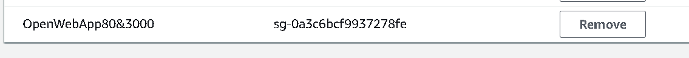

# AWS Notes

## What is the cloud?
'Cloud' is when you use someone else's computer (their storage and processing power) or when you use a server. It is the method of virtually accessing another computer to use it. 
## What is AWS
Amazon Web Services are the biggest cloud services provider, they provide IaaS, PaaS and SaaS. (See DevOps notes for more on these.)
## what is ec2
Elastic Compute Cloud: Using a computer's capacity (processing power) to run your applications. 
## what is a SG? 
A security Group acts as a virtual firewall for your EC2 instances to control incoming and outgonig traffic
## how do you open a port to your ip? and to the world?
__You would do this in the security group part of the instance setup process, however you can still edit SGs when your instance is up__
1. Go to your 'instances' tab in AWS 
2. Right click the instance then click the 'Edit Security Groups' button
3. You can set up access to your IP, Any IP or a Custom IP, as per this image. 

## Why should we not have port 22 open to all ips
Because it's not secure! 
## where do you keep you ssh keys?
in `~/.ssh` folder
## How to ssh into a remote server
`ssh -i your_ssh_key username@ip_address`

## how to send in 1 file to remote server
`scp -i your_ssh_key file_name username@ip_address:desired_location`
# how to send in multiple files to remote servers
`scp -i your_ssh_key -r folder_name username@ip_address:desired_location`

# General outiline of ops to get app running correctly
## Steps I took 
1. Change nginx.conf file
## Steps for the 'user' 
1. ssh into virtual machine (see above)
2. go to the directory where app is running, this directory is called `vagrant_n_tier`
3. `npm install` 
4. `pm2 start app`
5. go to the ip_address:3000 in your browser and you should see a success message. 
## Picture of App running on port 3000 and 80
### port 3000

### port 80 (Not Working)

## Testing if app on private IP port 3000 - curl privateip:3000

